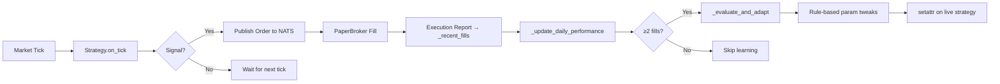
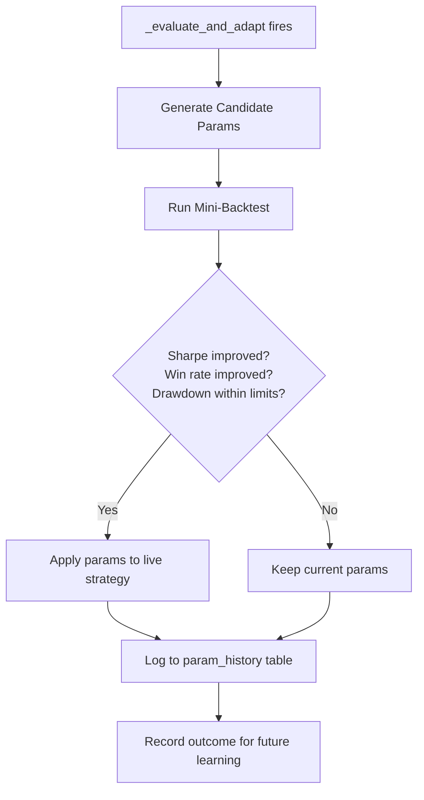
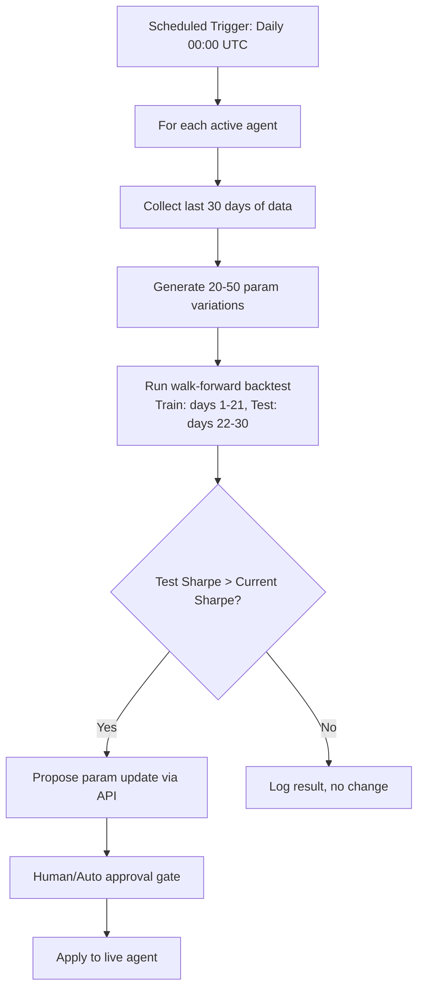
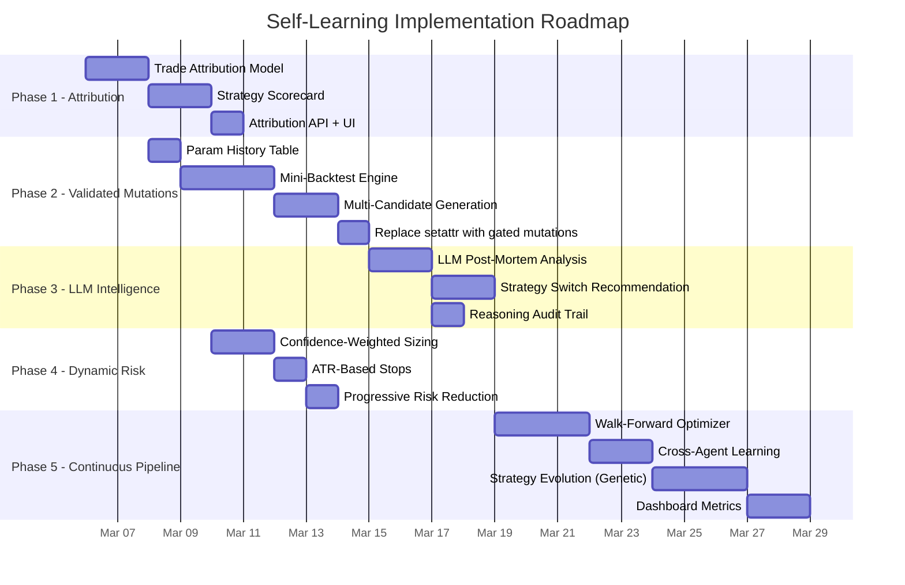

# Agent Self-Learning & Strategy Refinement Plan

> **Goal**: Transform agents from static-parameter executors into continuously improving systems that maximize P&L through data-driven adaptation, backtesting-validated mutations, and LLM-assisted strategy reasoning.

---

## Current State Assessment

### What Exists Today



### What's Wrong

| Problem | Impact | Root Cause |
|---------|--------|------------|
| **Rule-based adaptation is blind** | Adjustments may worsen performance | No validation — params changed live without backtesting the new values |
| **No memory of what was tried** | Same bad params can be re-tried | No history of parameter combinations and their outcomes |
| **Single-dimension tuning** | Moves one param at a time | Never explores param combinations (e.g., tighter RSI + wider BB simultaneously) |
| **No position sizing adaptation** | Fixed 10% allocation per trade | position_size_usd doesn't scale with confidence or volatility |
| **No trade-level attribution** | Can't distinguish "good signal, bad exit" from "bad signal" | Only aggregate win_rate/PnL tracked, not per-signal quality |
| **Strategies don't use historical context** | Every tick evaluated in isolation | No lookback to recent trade outcomes when deciding next entry |
| **No regime awareness in adaptation** | Same rules in trending and ranging markets | Parameter changes don't consider the current market regime |
| **LLM path (OODA) is fully disconnected from preset path** | 5 of 9 strategies unused in the self-learning system | The LLM OODA cycle has no strategy preset integration |

---

## Implementation Plan — 5 Phases

### Phase 1: Trade Attribution & Outcome Tracking (Foundation)

**Why**: You can't improve what you can't measure. Currently, the system tracks aggregate win_rate and PnL but doesn't know *why* a trade won or lost.

#### 1.1 Per-Trade Attribution Record

Add a `TradeAttribution` model that links every fill back to the signal that generated it:

```
TradeAttribution:
  trade_id: str
  agent_id: int
  strategy_name: str
  signal_type: str          # "golden_cross", "rsi_oversold", "volume_breakout"
  entry_price: float
  exit_price: float
  realized_pnl: float
  hold_duration_seconds: int
  market_regime: str        # "trending_up", "ranging", "volatile"
  params_snapshot: JSON     # exact params when signal was generated
  entry_indicators: JSON    # RSI=28, ADX=32, BB_width=0.04 at entry
  exit_reason: str          # "stop_loss", "take_profit", "signal_reversal", "time_stop"
```

**Implementation**: Modify each preset strategy's `on_tick()` to tag orders with signal metadata in `order.metadata`. Capture this in `handle_execution_report()` and store as a `TradeAttribution` record.

**Files to modify**:
- `src/database.py` — add `trade_attributions` table + CRUD
- `src/strategies/presets/*.py` — add `metadata` to each Order (signal_type, indicators at entry)
- `src/services/agent_orchestrator.py` — capture attribution on fill, link entry→exit pairs
- `src/api/routes/agents.py` — expose `/api/agents/{id}/attributions` for UI

#### 1.2 Strategy Scorecard

Compute per-strategy, per-signal-type performance metrics:

```
StrategyScorecard:
  strategy_name: str
  signal_type: str
  regime: str
  sample_size: int
  win_rate: float
  avg_pnl: float
  avg_hold_duration: float
  profit_factor: float
  best_params: JSON          # params snapshot from best-performing trades
  worst_params: JSON         # params snapshot from worst-performing trades
```

**Why this matters**: Knowing "RSI oversold entries have 65% win rate in trending markets but 30% in ranging markets" lets the agent disable signals in the wrong regime instead of blindly tightening all params.

---

### Phase 2: Backtest-Validated Parameter Mutation (Core Learning Loop)

**Why**: The current system changes live params without knowing if the new values are better. This phase adds a "try it in backtest first" gate.



#### 2.1 Parameter History Table

```sql
CREATE TABLE param_mutations (
    id SERIAL PRIMARY KEY,
    agent_id INT REFERENCES agents(id),
    timestamp TIMESTAMPTZ DEFAULT NOW(),
    previous_params JSONB,
    candidate_params JSONB,
    mutation_reason TEXT,       -- "low_win_rate", "high_drawdown", etc.
    backtest_sharpe FLOAT,
    backtest_win_rate FLOAT,
    backtest_pnl FLOAT,
    backtest_trades INT,
    accepted BOOLEAN,          -- was this mutation applied?
    live_pnl_after_7d FLOAT    -- filled in 7 days later to validate
);
```

#### 2.2 Mini-Backtest Before Applying Changes

Replace the current `setattr()` approach with a mini-backtest validation:

```python
async def _evaluate_and_adapt(self, ...):
    # 1. Generate candidate params using current rules
    candidates = self._generate_candidates(win_rate, sharpe, max_drawdown, ...)

    # 2. Run quick backtest on last 7 days of data
    for candidate_params in candidates:
        result = await self._mini_backtest(candidate_params, days=7)

        # 3. Only apply if improvement is demonstrated
        if (result["sharpe"] > sharpe + 0.1 or
            result["win_rate"] > win_rate + 0.05):
            self._apply_params(candidate_params)
            await self._log_mutation(candidate_params, result, accepted=True)
            break
    else:
        await self._log_mutation(candidates[0], result, accepted=False)
```

#### 2.3 Multi-Candidate Generation

Instead of a single adjustment direction, generate 3-5 candidates:

| Candidate | Strategy |
|-----------|----------|
| **Conservative** | Current rules: tighten entries by 1 step |
| **Aggressive** | Tighten entries by 2 steps + reduce lookback |
| **Regime-aware** | If trending: widen entries. If ranging: tighten entries |
| **Historical best** | Use params from the best-performing day in history |
| **LLM-suggested** | Ask the LLM to propose params given the scorecard data |

**Files to modify**:
- `src/database.py` — add `param_mutations` table
- `src/services/agent_orchestrator.py` — replace `_evaluate_and_adapt` with mini-backtest loop
- `src/backtest/mini_engine.py` (new) — lightweight backtest runner that works on recent data in memory
- `src/api/routes/agents.py` — expose `/api/agents/{id}/mutations` for UI

---

### Phase 3: LLM-Assisted Strategy Reasoning (Intelligence Layer)

**Why**: Rule-based adaptation can only tune predefined params. An LLM can reason about *why* trades failed and suggest structural changes.

#### 3.1 Post-Mortem Analysis

After every N losing trades (or on a schedule), send the trade attribution data to the LLM for analysis:

```python
async def _llm_post_mortem(self, recent_attributions: List[TradeAttribution]):
    """Ask LLM to analyze recent losing trades and suggest improvements."""
    prompt = f"""
    Agent: {self.config.name}
    Strategy: {self.config.strategy_name}
    Current params: {json.dumps(self.config.strategy_params)}

    Recent trades (last 7 days):
    {self._format_attributions(recent_attributions)}

    Current scorecard:
    - Win rate: {scorecard.win_rate:.1%}
    - Avg PnL per trade: ${scorecard.avg_pnl:.2f}
    - Best signal type: {scorecard.best_signal} ({scorecard.best_win_rate:.1%})
    - Worst signal type: {scorecard.worst_signal} ({scorecard.worst_win_rate:.1%})
    - Current regime: {current_regime}

    Analyze the losing trades and suggest:
    1. Which specific signal types to disable in the current regime
    2. Parameter adjustments with reasoning
    3. Whether the strategy is fundamentally unsuited for current conditions
    4. A confidence score (0-100) for your suggestions

    Respond in JSON:
    {{
      "analysis": "string",
      "disable_signals": ["signal_type1"],
      "param_suggestions": {{"param": value}},
      "strategy_suitable": true/false,
      "confidence": 0-100,
      "alternative_strategy": "strategy_name or null"
    }}
    """
```

#### 3.2 Strategy Switching Recommendation

If the LLM determines a strategy is fundamentally unsuited for current market conditions, propose a strategy switch:

- The agent can be temporarily reconfigured to a different preset from the 9 available strategies
- The switch is only applied after a mini-backtest confirms the alternative performs better
- The original strategy is restored when the LLM detects the regime has changed back

#### 3.3 Reasoning Audit Trail

All LLM reasoning is stored in `agent_decisions` with `phase="llm_postmortem"`:
- Input data sent to LLM
- Full LLM response
- Whether suggestions were applied
- Performance impact 7 days later

**Files to modify**:
- `src/services/agent_orchestrator.py` — add `_llm_post_mortem()` method
- `src/llm_client.py` — ensure structured JSON responses are handled
- `src/api/routes/agents.py` — expose `/api/agents/{id}/reasoning` for UI

---

### Phase 4: Dynamic Position Sizing & Risk Adaptation

**Why**: Currently every trade uses `allocation_usd * 0.1` regardless of signal quality or market conditions. This leaves profit on the table during high-confidence signals and exposes too much during low-confidence ones.

#### 4.1 Confidence-Weighted Position Sizing

```python
def _calculate_position_size(self, signal_confidence: float, regime: str) -> float:
    """Scale position size by signal confidence and regime."""
    base = self.config.allocation_usd * 0.1  # current 10%

    # Confidence scaling: 0.3x at low confidence, 1.5x at high confidence
    confidence_multiplier = 0.3 + (signal_confidence / 100) * 1.2

    # Regime scaling
    regime_multipliers = {
        "trending_up": 1.2,    # Trend-following strategies perform better
        "trending_down": 1.0,
        "ranging": 0.6,        # Mean-reversion only, reduce size
        "volatile": 0.4,       # High uncertainty, reduce exposure
    }
    regime_mult = regime_multipliers.get(regime, 0.8)

    size = base * confidence_multiplier * regime_mult
    return min(size, self.config.risk_guardrails.max_position_size_usd)
```

#### 4.2 Adaptive Stop-Loss Based on ATR

Instead of fixed percentage stops, use ATR-scaled stops that adapt to volatility:

```python
def _calculate_stop(self, price: float, atr: float, side: str) -> float:
    """ATR-based stop that adapts to current volatility."""
    atr_multiple = 2.0  # Can be tuned by self-learning

    if side == "buy":
        return price - (atr * atr_multiple)
    else:
        return price + (atr * atr_multiple)
```

#### 4.3 Daily Loss Circuit Breaker Enhancement

Currently the kill switch triggers at 20% drawdown. Add progressive risk reduction:

| Drawdown Level | Action |
|---------------|--------|
| 3-5% | Reduce position size by 30% |
| 5-10% | Reduce position size by 50%, increase selectivity |
| 10-15% | Reduce to minimum position size, only highest-confidence signals |
| >15% | Pause agent, trigger LLM post-mortem |

**Files to modify**:
- `src/services/agent_orchestrator.py` — `_run_strategy_cycle()` position sizing logic
- `src/strategies/presets/*.py` — add signal confidence scoring to each strategy
- `src/config.py` — add `ProgressiveRiskConfig` model

---

### Phase 5: Continuous Improvement Pipeline (Autonomy)

**Why**: Phases 1-4 make agents smarter within their current strategy. Phase 5 makes the *system* smarter by discovering new strategies and evolving existing ones.

#### 5.1 Walk-Forward Optimization Loop

Run automatically on a schedule (daily or weekly):



#### 5.2 Cross-Agent Learning

When one agent discovers params that perform well, share the knowledge:

```python
async def _cross_pollinate(self):
    """Check if other agents with the same strategy found better params."""
    all_mutations = await self.db.get_successful_mutations(
        strategy_name=self.config.strategy_name,
        min_sharpe_improvement=0.2,
        days=14,
    )

    for mutation in all_mutations:
        if mutation.agent_id != self.agent_id:
            # Another agent found better params — validate for our data
            result = await self._mini_backtest(mutation.candidate_params, days=7)
            if result["sharpe"] > current_sharpe:
                self._apply_params(mutation.candidate_params)
                logger.info("Agent %d adopted params from agent %d", ...)
```

#### 5.3 Strategy Evolution (Genetic Approach)

For longer-term improvement, periodically spawn "child" agents that combine traits of the best-performing parents:

1. **Selection**: Pick the 2 best-performing agents (highest Sharpe over 30 days)
2. **Crossover**: Combine strategy params (e.g., parent A's RSI params + parent B's position sizing)
3. **Mutation**: Randomly perturb 1-2 params by ±10-20%
4. **Evaluation**: Run the child through a full backtest
5. **Promotion**: If the child outperforms both parents on the test set, deploy in paper mode
6. **Retirement**: Retire the worst-performing agent to make room

#### 5.4 Performance Dashboard Metrics

Add these metrics to the frontend:

| Metric | Description |
|--------|-------------|
| **Learning Rate** | How many successful mutations per week |
| **Adaptation Speed** | Time from performance drop to recovery |
| **Param Stability** | How often params are changing (too much = overfitting) |
| **Regime Accuracy** | Did the agent correctly identify the market regime? |
| **Signal Quality** | Per-signal-type win rate over time |
| **Strategy Health** | Composite score: Sharpe + stability + drawdown trend |

---

## Implementation Priority & Dependencies



## Quick Wins (Can Do Now)

These are immediate improvements that don't require the full pipeline:

1. **Add regime detection to `_evaluate_and_adapt()`** — use the price data already in `_market_cache` to detect trending vs ranging and apply different adaptation rules

2. **Track param change history** — log every `setattr` call to `agent_decisions` with `phase="param_change"` so there's an audit trail

3. **Add signal metadata to orders** — modify strategies to include `signal_type` in the order to start building attribution data

4. **Progressive position sizing** — reduce size after consecutive losses, increase after consecutive wins (simple Kelly-criterion inspired approach)

5. **Cooldown after adaptation** — after changing params, wait N cycles before evaluating again to let the new params produce measurable results

---

## Key Files Affected

| File | Phase | Changes |
|------|-------|---------|
| `src/database.py` | 1, 2 | New tables: `trade_attributions`, `param_mutations`, `strategy_scorecards` |
| `src/services/agent_orchestrator.py` | 1-5 | Core learning loop rewrite, LLM post-mortem, cross-pollination |
| `src/strategies/presets/*.py` | 1, 4 | Signal metadata, confidence scoring |
| `src/backtest/mini_engine.py` (new) | 2 | Lightweight in-memory backtest for param validation |
| `src/services/llm_proxy.py` | 3 | Structured JSON response handling |
| `src/api/routes/agents.py` | 1-5 | New endpoints for attributions, mutations, reasoning |
| `src/config.py` | 4 | `ProgressiveRiskConfig` model |
| Frontend components | 5 | Learning metrics dashboard |

## Success Metrics

| Metric | Current | Phase 1-2 Target | Phase 3-5 Target |
|--------|---------|-------------------|-------------------|
| Avg daily PnL | -$37 to +$67 | Positive for 3/4 agents | Positive for all agents |
| Win rate | 0-100% (volatile) | >45% stable | >50% stable |
| Sharpe (30d rolling) | -11.2 to 0 | >0.5 | >1.0 |
| Max drawdown | ~0.4% | <5% | <3% |
| Learning cycles per week | 0 validated | 3-5 backtested | 10+ with LLM reasoning |
| False adaptations | Unknown | <30% (via backtest gate) | <15% (via LLM + backtest) |
