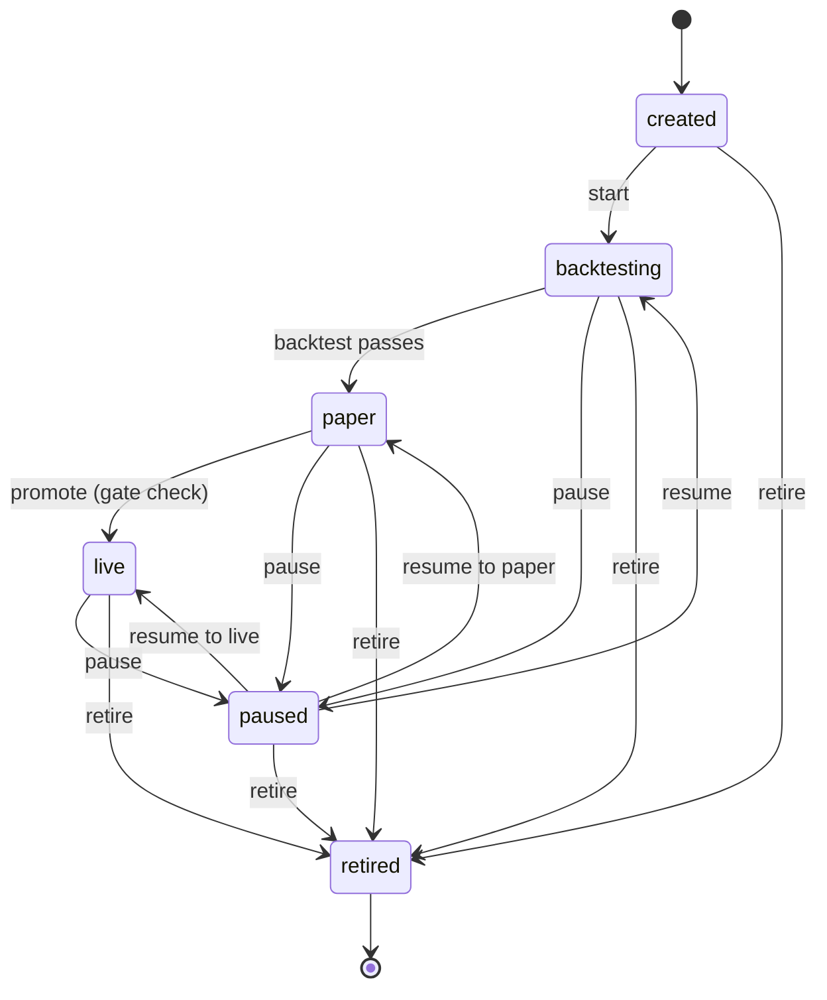

# Agent System

Autonomous trading agents managed by the Agent Orchestrator service. Each agent runs independently with its own strategy, allocation, risk limits, and performance tracking.

## Overview

An **agent** is an autonomous trading unit that:
- Runs a specific strategy against one or more symbols
- Has a dedicated USD allocation and risk guardrails
- Progresses through a lifecycle from creation to retirement
- Executes decisions via the OODA loop (Observe → Orient → Decide → Act → Learn)
- Tracks performance metrics daily (PnL, Sharpe, win rate, drawdown)

Agents are created via the API, managed by the Agent Orchestrator service (port 8088), and can operate in two modes:
1. **Strategy mode** — executes a preset strategy from the strategy registry (no LLM)
2. **LLM mode** — uses an LLM (via the Copilot proxy at port 8087) for market analysis and decisions

Relevant source files:
- `src/services/agent_orchestrator.py` — orchestrator service, OODA loop, state machine
- `src/api/routes/agents.py` — REST API endpoints
- `src/database.py` — `Agent`, `AgentDecision`, `AgentPerformance` models
- `src/risk/portfolio_risk.py` — portfolio-level risk constraints

---

## Lifecycle

Agents follow a strict lifecycle with gated promotions to prevent untested strategies from trading live capital.



### Valid Transitions

| Current Status | Allowed Targets |
|---------------|----------------|
| `created` | `backtesting`, `retired` |
| `backtesting` | `paper`, `paused`, `retired` |
| `paper` | `live`, `paused`, `retired` |
| `live` | `paused`, `retired` |
| `paused` | `backtesting`, `paper`, `live`, `retired` |
| `retired` | *(none — terminal state)* |

### Promotion Gates

**Backtest → Paper**: Automatic after the backtest gate passes (configured via `AgentBacktestRequirements` in `src/config.py`).

**Paper → Live** (via `POST /api/agents/{id}/promote`):
- Minimum 14 days of paper trading data
- Minimum 10 paper trades completed
- Use `force=true` to bypass the gate check

### Resume Behavior

Resuming a paused agent defaults to `backtesting` status — the agent must re-earn its way through the lifecycle.

---

## OODA Loop

Each agent runs one of two cycle types on its configured `rebalance_interval_seconds`:

### Strategy Cycle (Non-LLM)

For agents with a `strategy_name` from the strategy registry. The cycle:

1. **Refresh** — checks agent status from DB (skips if paused/retired)
2. **Evaluate** — runs `strategy.on_tick(market_data)` for each target symbol
3. **Size** — applies confidence-weighted, regime-aware position sizing with progressive risk reduction
4. **Submit** — publishes order intents to NATS `trading.orders`
5. **Record** — creates `TradeAttribution` and `AgentDecision` records

### LLM OODA Cycle

For agents without a preset strategy. Uses the LLM proxy for market analysis:

| Phase | Action | Details |
|-------|--------|---------|
| **Observe** | Gather market data | Collects price, volume, 24h change, bid/ask, indicators for all target symbols |
| **Orient** | LLM analysis | Sends market context to LLM; receives regime classification, confidence score (0-100), thesis, and recommended action |
| **Decide** | Generate order intent | Converts LLM recommendation to order parameters with risk checks |
| **Act** | Execute | Publishes order intents to NATS `trading.orders` |
| **Learn** | Record & adapt | Stores `AgentDecision` record; updates daily performance |

The LLM is prompted to respond with structured JSON:
```json
{
  "regime": "trending_up|trending_down|ranging|volatile",
  "confidence": 0-100,
  "thesis": "string",
  "recommended_action": "buy|sell|hold|reduce",
  "reasoning": "string"
}
```

If the LLM is unavailable, the orient phase defaults to `hold` with zero confidence.

### Scheduling

- `rebalance_interval_seconds` — how often the cycle runs
- `pause_on_weekends` — skips cycles on Saturday/Sunday (UTC)
- `active_hours_utc` — list of UTC hours during which the agent is active

---

## Configuration

### Agent Creation

```bash
curl -X POST http://localhost:8000/api/agents \
  -H "X-API-Key: $API_KEY" \
  -H "Content-Type: application/json" \
  -d '{
    "name": "btc-trend-follower",
    "allocation_usd": 5000,
    "strategy_name": "dual-ma-crossover",
    "strategy_params": {
      "fast_period": 10,
      "slow_period": 30,
      "adx_threshold": 25
    },
    "config": {
      "target": {"symbols": ["BTCUSDT"]},
      "schedule": {"rebalance_interval_seconds": 300}
    }
  }'
```

### Key Fields

| Field | Type | Description |
|-------|------|-------------|
| `name` | string | Unique agent name |
| `allocation_usd` | float | USD budget allocated to this agent |
| `strategy_name` | string (optional) | Preset strategy from registry (omit for LLM mode) |
| `strategy_params` | dict (optional) | Strategy-specific parameters |
| `config` | dict | Agent configuration including targets, schedule, risk guardrails |

### Available Strategies

| Strategy | Parameters | Style |
|----------|-----------|-------|
| `dual-ma-crossover` | `fast_period` (5-20), `slow_period` (15-50), `adx_threshold` (15-40) | Trend following, conservative |
| `bollinger-mean-reversion` | `bb_period` (10-30), `bb_std` (1.5-3.0) | Mean reversion, moderate |
| `breakout-volume` | `lookback` (10-40), `volume_multiplier` (1.0-3.0) | Momentum, aggressive |
| `adaptive-rsi` | `rsi_period` (3-21), `rsi_entry_low` (5-30), `rsi_entry_high` (70-95) | Multi-asset rotation, moderate |

### AI-Assisted Agent Builder

Use natural language to create agents:

```bash
curl -X POST http://localhost:8000/api/agents/suggest \
  -H "X-API-Key: $API_KEY" \
  -H "Content-Type: application/json" \
  -d '{"prompt": "I want a conservative BTC agent that follows trends"}'
```

Returns a suggested configuration with strategy, parameters, symbols, allocation, and reasoning.

---

## Risk Controls

### Per-Agent Guardrails

Configured via `risk_guardrails` in the agent config:

| Parameter | Description |
|-----------|-------------|
| `max_position_size_usd` | Maximum notional size per position |
| `max_open_positions` | Maximum concurrent positions |

### Portfolio-Level Constraints

Enforced by `PortfolioRiskManager` (`src/risk/portfolio_risk.py`) before every order:

| Constraint | Default | Description |
|-----------|---------|-------------|
| Max total exposure | $50,000 | Sum of all agent positions across the portfolio |
| Max symbol concentration | 40% | No single symbol can exceed this percentage of total exposure |
| Max agent correlation | 0.70 | Rolling 30-day return correlation between agents |
| Max total agents | 10 | Maximum concurrent active agents |

### Position Sizing

Strategy-mode agents use multi-factor sizing:
- **Confidence multiplier**: 0.3× at 0 confidence, 1.5× at 100
- **Regime multiplier**: trending_up=1.2×, trending_down=1.0×, ranging=0.6×, volatile=0.4×
- **Progressive risk reduction**: reduces size based on drawdown
- Final size is capped at `max_position_size_usd`

### Kill Switch

Retire or pause all agents to stop trading:

```bash
# Pause one agent
curl -X POST -H "X-API-Key: $API_KEY" http://localhost:8000/api/agents/{id}/pause

# Retire permanently
curl -X POST -H "X-API-Key: $API_KEY" http://localhost:8000/api/agents/{id}/retire
```

---

## API Endpoints

All endpoints require the `X-API-Key` header.

### CRUD

| Method | Path | Description |
|--------|------|-------------|
| `GET` | `/api/agents` | List all agents (optional `?status_filter=paper`) |
| `POST` | `/api/agents` | Create a new agent |
| `GET` | `/api/agents/{id}` | Get agent details |
| `PUT` | `/api/agents/{id}` | Update agent (blocked for `live`/`retired` agents) |
| `DELETE` | `/api/agents/{id}` | Delete agent (must be `retired` or `created` first) |

### Lifecycle Actions

| Method | Path | Description |
|--------|------|-------------|
| `POST` | `/api/agents/{id}/start` | Start agent → transitions to `backtesting` |
| `POST` | `/api/agents/{id}/pause` | Pause agent |
| `POST` | `/api/agents/{id}/resume` | Resume paused agent → `backtesting` |
| `POST` | `/api/agents/{id}/promote` | Promote from `paper` → `live` (with gate check) |
| `POST` | `/api/agents/{id}/retire` | Retire agent permanently |

### Data & Performance

| Method | Path | Description |
|--------|------|-------------|
| `GET` | `/api/agents/{id}/journal?limit=50` | Agent decision history |
| `GET` | `/api/agents/{id}/performance?days=30` | Daily performance records |

### AI Builder

| Method | Path | Description |
|--------|------|-------------|
| `POST` | `/api/agents/suggest` | AI-assisted agent configuration suggestion |

---

## Monitoring

### Prometheus Metrics

| Metric | Labels | Description |
|--------|--------|-------------|
| `agent_ooda_cycles_total` | `agent_id`, `phase` | Total OODA cycles executed per phase |
| `agent_active_count` | — | Number of actively running agent runners |
| `agent_ooda_cycle_seconds` | — | Histogram of cycle duration (buckets: 0.5s to 60s) |

### Performance Tracking

Daily `AgentPerformance` records include:

| Field | Description |
|-------|-------------|
| `realized_pnl` | Realized profit/loss for the day |
| `unrealized_pnl` | Unrealized P&L from open positions |
| `total_trades` | Number of trades executed |
| `win_rate` | Percentage of winning trades |
| `sharpe_rolling_30d` | 30-day rolling Sharpe ratio |
| `max_drawdown` | Maximum drawdown observed |
| `equity` | Current equity value |

### Decision Journal

Every cycle records an `AgentDecision` with:
- `phase` — which OODA phase generated this entry
- `market_snapshot_json` — price, symbol, regime at decision time
- `decision_json` — what the agent decided (strategy, action, size)
- `outcome_json` — the resulting order intent
- `trade_ids` — idempotency keys of submitted orders

### Audit Trail

All state transitions are logged to the audit table with:
- Action: `agent_transition`
- Details: `{"from": "paper", "to": "live"}`
- Actor: `api`
