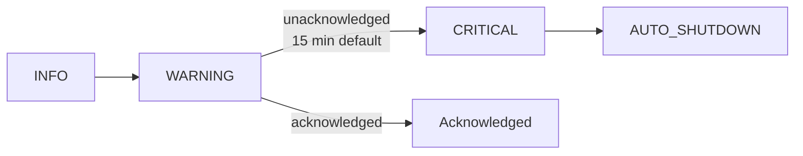

# Operational Runbook

Operator-focused guide for running, monitoring, and troubleshooting the trading bot platform.

## Prerequisites

### Required Software

| Software | Minimum Version | Purpose |
|----------|----------------|---------|
| Docker | 20.10+ | Container runtime |
| Docker Compose | 2.x | Service orchestration |
| Git | 2.30+ | Source control |

### Required Environment Variables

Copy `.env.example` to `.env` and configure:

| Variable | Required | Default | Description |
|----------|----------|---------|-------------|
| `POSTGRES_PASSWORD` | **Yes** | — | PostgreSQL password (generate a secure random string) |
| `API_KEY` | **Yes** | — | API key for FastAPI auth (generate a secure random token) |
| `APP_MODE` | No | `paper` | Operating mode: `paper`, `live`, or `replay` |
| `POSTGRES_USER` | No | `tradingbot` | PostgreSQL username |
| `POSTGRES_DB` | No | `tradingbot` | PostgreSQL database name |
| `VAULT_MASTER_KEY` | No | — | Fernet key for credential vault encryption |
| `EXCHANGE_API_KEY` | Live only | — | Exchange API key (Bybit) |
| `EXCHANGE_SECRET_KEY` | Live only | — | Exchange API secret |
| `CORS_ORIGINS` | No | `http://localhost:3000,http://localhost:8080` | Allowed CORS origins |
| `ALERT_WEBHOOK_URL` | No | — | Discord/Slack webhook URL for alerts |
| `TRADINGVIEW_WEBHOOK_SECRET` | No | — | HMAC secret for TradingView webhook validation |
| `BACKUP_ENCRYPTION_KEY` | No | — | Encryption key for database backups |
| `LLM_PROVIDER` | No | `github-copilot` | LLM provider for AI agents |
| `GEMINI_API_KEY` | No | — | Gemini API key (if using Gemini LLM) |

### Networking

| Port | Service | Container | Protocol |
|------|---------|-----------|----------|
| 3080 | Frontend (nginx) | `frontend` | HTTP |
| 8000 | API Server (FastAPI) | `api-server` | HTTP/WS |
| 8080 | Execution Service | `execution` | HTTP |
| 8081 | Feed Service | `feature-engine` | HTTP |
| 8083 | Reporter Service | `reporter` | HTTP |
| 8084 | Risk State Service | `risk-state` | HTTP |
| 8085 | Replay Service | `replay-service` | HTTP |
| 8086 | Signal Engine | `signal-engine` | HTTP |
| 8087 | LLM Proxy (Copilot) | `copilot-proxy` | HTTP |
| 8088 | Agent Orchestrator | `agent-orchestrator` | HTTP |
| 5432 | PostgreSQL (TimescaleDB) | `postgres` | TCP |
| 4222 | NATS (client) | `nats-server` | TCP |
| 8222 | NATS (monitoring) | `nats-server` | HTTP |
| 9090 | Prometheus | `prometheus` | HTTP |
| 3000 | Grafana | `grafana` | HTTP |

---

## Starting the System

### Paper Trading (Default)

```bash
cp .env.example .env
# Edit .env — set POSTGRES_PASSWORD and API_KEY at minimum

APP_MODE=paper docker compose up --build -d
```

### Live Trading

```bash
APP_MODE=live docker compose up --build -d
```

> **Warning:** Live mode connects to real exchanges and executes real trades. Ensure `EXCHANGE_API_KEY` and `EXCHANGE_SECRET_KEY` are set and valid.

### Replay Mode

```bash
APP_MODE=replay docker compose up --build -d
```

Replay mode streams historical data from Parquet files in `sample_data/` via the replay service (port 8085).

### VPS Deployment (Latency-Sensitive)

For co-located VPS deployments, use the VPS override to run only latency-sensitive services:

```bash
docker compose -f docker-compose.yml -f docker-compose.vps.yml up -d
```

This deploys only: `postgres`, `nats`, `strategy-engine`, `execution`, `feature-engine`, `signal-engine`, `risk-state`. Non-essential services (frontend, grafana, reporter, replay, agents) are disabled via the `local-only` profile.

The VPS override also:
- Sets `APP_MODE=live` and `VPS_MODE=true` by default
- Applies CPU/memory resource limits to each service
- Configures NATS as a leaf node bridging to a home NATS cluster via WireGuard

### Stopping

```bash
docker compose down
```

To also remove volumes (**destroys all data**):

```bash
docker compose down -v
```

---

## Service Health Checks

All services expose a `/health` endpoint. Docker health checks run every 15 seconds with a 5-second timeout and 3 retries.

| Service | URL | Expected Response |
|---------|-----|-------------------|
| API Server | `http://localhost:8000/health` | `{"status": "ok", "service": "api-server"}` |
| Execution | `http://localhost:8080/health` | `{"status": "ok", ...}` |
| Feed | `http://localhost:8081/health` | `{"status": "ok", ...}` |
| Reporter | `http://localhost:8083/health` | `{"status": "ok", ...}` |
| Risk State | `http://localhost:8084/health` | `{"status": "ok", ...}` |
| Replay | `http://localhost:8085/health` | `{"status": "ok", ...}` |
| Signal Engine | `http://localhost:8086/health` | `{"status": "ok", ...}` |
| LLM Proxy | `http://localhost:8087/health` | `{"status": "ok", ...}` |
| Agent Orchestrator | `http://localhost:8088/health` | `{"status": "ok", ...}` |
| NATS | `http://localhost:8222/varz` | JSON with server stats |
| PostgreSQL | `pg_isready -h localhost -U tradingbot` | `accepting connections` |

### Quick Check — All Services

```bash
# Docker health status overview
docker compose ps

# Curl each service health endpoint
for port in 8000 8080 8081 8083 8084 8085 8086 8087 8088; do
  echo "Port $port: $(curl -sf http://localhost:$port/health | head -c 80)"
done
```

---

## Correlation ID Tracing

Every HTTP request gets a unique `X-Request-ID` header (auto-generated if not supplied by the client). The `CorrelationIdMiddleware` propagates this ID through all log entries for that request.

```bash
# Find all logs for a specific request across services
docker compose logs | grep '"request_id": "abc123"'

# Filter a single service
docker compose logs execution --no-log-prefix | grep "abc123"
```

## Log Format

All services emit structured JSON logs:

```json
{
  "timestamp": "2026-03-05T12:00:00+0000",
  "level": "INFO",
  "service": "execution",
  "name": "src.services.execution",
  "message": "Order placed successfully",
  "request_id": "abc123def456"
}
```

---

## Common Issues

### Service Won't Start

| Symptom | Likely Cause | Fix |
|---------|-------------|-----|
| `POSTGRES_PASSWORD must be set` | Missing env var | Set `POSTGRES_PASSWORD` in `.env` |
| `API_KEY must be set` | Missing env var | Set `API_KEY` in `.env` |
| Container exits with code 1 | Python import/config error | Check logs: `docker logs <container> --tail 50` |
| Port already in use | Conflicting process | `lsof -i :<port>` then stop the conflict |
| Health check failing | Service still starting | Wait for `start_period` (20-30s), then check logs |

### Database Connection Fails

```bash
# Verify PostgreSQL is healthy
docker compose exec postgres pg_isready -U tradingbot

# Check active connection count
docker compose exec postgres psql -U tradingbot -c "SELECT count(*) FROM pg_stat_activity;"

# View PostgreSQL logs
docker logs postgres --tail 50
```

### Exchange Timeout

- Verify `EXCHANGE_API_KEY` and `EXCHANGE_SECRET_KEY` are correct
- Check exchange reachability: `curl -s https://api.bybit.com/v5/market/time`
- In paper mode, the exchange client uses `PaperBroker` — no real exchange connection is needed
- The API server starts with limited functionality if exchange initialization fails (non-fatal)

### NATS Unavailable

Services fall back to `MockMessagingClient` when NATS is unreachable:
- Inter-service communication is degraded (no real-time event propagation)
- WebSocket bridge won't relay NATS messages to the frontend
- Strategy engine and agents still operate independently

```bash
# Check NATS status
curl -s http://localhost:8222/varz | python3 -m json.tool

# Restart NATS and dependent services
docker restart nats-server
docker restart strategy-engine execution signal-engine
```

### High Latency

1. Check execution service logs for slow orders
2. Verify exchange API health: `curl https://api.bybit.com/v5/market/time`
3. Review resource usage: `docker stats`
4. Check NATS message backlog at `http://localhost:8222/connz`

---

## Monitoring

See [monitoring.md](monitoring.md) for the full monitoring guide.

### Quick Reference

| Tool | URL | Purpose |
|------|-----|---------|
| Prometheus | `http://localhost:9090` | Metrics collection and queries |
| Grafana | `http://localhost:3000` | Dashboards and visualization |
| API Metrics | `http://localhost:8000/metrics` | Prometheus-format application metrics |
| NATS Monitor | `http://localhost:8222` | NATS server status |

### Prometheus Scrape Targets

Configured in `prometheus.yml` with a 15-second scrape interval:

| Job | Target |
|-----|--------|
| `prometheus` | `localhost:9090` |
| `strategy-engine` | `strategy-engine:8000` |
| `execution` | `execution:8080` |
| `feature-engine` | `feature-engine:8081` |
| `ops-api` | `ops-api:8082` |
| `reporter` | `reporter:8083` |
| `risk-state` | `risk-state:8084` |
| `replay` | `replay-service:8085` |

### Key Metrics

| Metric | Type | Description |
|--------|------|-------------|
| `agent_ooda_cycles_total` | Counter | Total OODA cycles by agent and phase |
| `agent_active_count` | Gauge | Number of actively running agents |
| `agent_ooda_cycle_seconds` | Histogram | Duration of a full OODA cycle |

---

## Alert Escalation

The escalation engine (`src/notifications/escalation.py`) manages alarm severity lifecycle with automatic timer-based escalation.



### Severity Levels

| Level | Trigger | Action |
|-------|---------|--------|
| **INFO** | Informational event | Logged only |
| **WARNING** | Unusual condition detected | Notification sent; escalation timer starts (default: 900s) |
| **CRITICAL** | Unacknowledged WARNING or severe issue | `on_critical` callback: pauses agents, notifies all channels |
| **AUTO_SHUTDOWN** | Unrecoverable condition | `on_shutdown` callback: triggers kill switch |

Acknowledging an alarm stops its escalation timer. Alarms can be acknowledged via the API or frontend UI.

---

## Emergency Procedures

### Kill Switch — Stop All Trading

1. **Pause all agents** via API:
   ```bash
   # List active agents
   curl -s -H "X-API-Key: $API_KEY" http://localhost:8000/api/agents | python3 -m json.tool

   # Pause a specific agent
   curl -X POST -H "X-API-Key: $API_KEY" http://localhost:8000/api/agents/{id}/pause
   ```

2. **Stop the execution service** (prevents order submission):
   ```bash
   docker stop execution
   ```

3. **Stop the strategy engine** (halts all strategy processing):
   ```bash
   docker stop strategy-engine
   ```

### Circuit Breaker / Risk Checks

The risk state service (port 8084) and `PortfolioRiskManager` enforce:
- Max total exposure across all agents
- Max symbol concentration percentage
- Max correlation between agents (rolling 30-day returns)
- Per-agent position limits and max position size

Orders that violate constraints are rejected with detailed rejection reasons.

```bash
# Check risk state
curl -s -H "X-API-Key: $API_KEY" http://localhost:8000/api/risk/state | python3 -m json.tool
```

### Graceful Shutdown

```bash
docker compose down --timeout 30
```

The API server lifespan handler ensures orderly cleanup:
1. WebSocket heartbeat and NATS bridge are stopped
2. NATS messaging client is closed
3. Exchange client is closed
4. Database connections are closed

---

## Maintenance

### Database Backup

Automated daily backups run via the `db-backup` container at 02:00 UTC:
- Uses `pg_dump` via the `scripts/backup.sh` entrypoint
- Encrypted with `age` if `BACKUP_ENCRYPTION_KEY` is set
- Retention: 7 daily + 4 weekly backups
- Stored in the `backup_data` Docker volume

**Manual backup:**
```bash
docker exec postgres pg_dump -U tradingbot tradingbot > backup_$(date +%Y%m%d).sql
```

**Restore from backup:**
```bash
cat backup_20260305.sql | docker exec -i postgres psql -U tradingbot tradingbot
```

### Log Rotation

Container logs are managed by Docker's logging driver. To configure rotation, add to any service in `docker-compose.yml`:

```yaml
logging:
  driver: "json-file"
  options:
    max-size: "10m"
    max-file: "3"
```

### Log Level Adjustment

```bash
# Restart a service with debug logging
LOG_LEVEL=DEBUG docker compose up -d --no-deps execution
```

### Credential Rotation

1. **API Key** — uses 24-hour grace period (`src/api/routes/auth.py`):
   - Old key remains valid for 24 hours after rotation
   - Update `API_KEY` in `.env` and restart services after grace period

2. **Exchange credentials** — via the credential vault (see [vault.md](vault.md)):
   - Store new: `POST /api/vault/credentials`
   - Test: `POST /api/vault/credentials/{id}/test`
   - Delete old: `DELETE /api/vault/credentials/{id}`

3. **Vault master key**:
   - Generate: `python -c "from src.security.credential_vault import generate_master_key; print(generate_master_key())"`
   - Re-encrypt all stored credentials before rotating (manual process)
   - Update `VAULT_MASTER_KEY` in `.env` and restart

### Updating Services

```bash
git pull
docker compose build
docker compose up -d
```

For rolling updates (restart one service at a time):

```bash
docker compose up -d --build --no-deps api-server
docker compose up -d --build --no-deps execution
```
