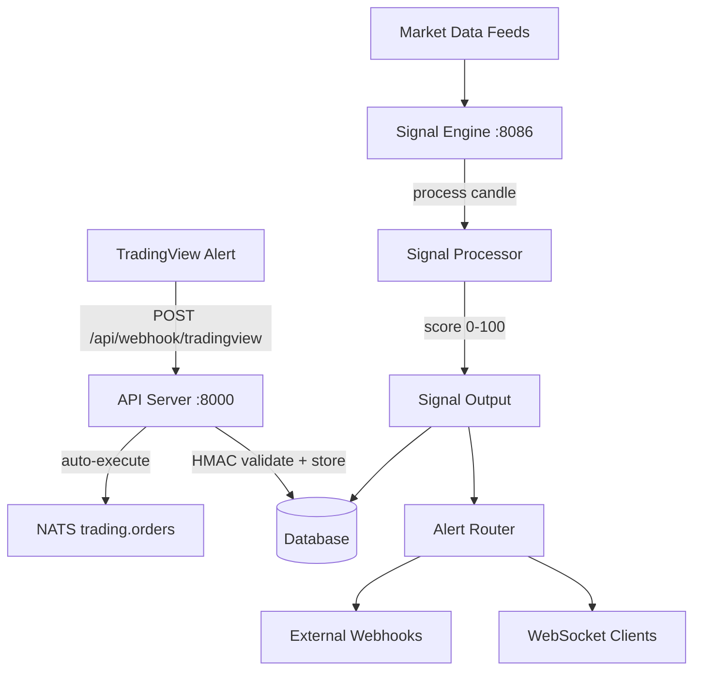

# Signal Engine

Multi-asset, multi-timeframe trading signal generation with 0–100 confluence scoring.

## Overview

The signal engine runs as an independent FastAPI microservice on port 8086. It:
- Receives external signals via TradingView webhooks (HMAC-validated)
- Generates internal signals from market data subscriptions with confluence scoring
- Routes alerts to WebSocket clients and webhook endpoints
- Persists signals to the database for history and audit
- Optionally auto-executes signals by converting them to order intents

Relevant source files:
- `src/signal_engine/main.py` — FastAPI service, lifecycle, endpoints
- `src/signal_engine/schemas.py` — data models (signals, features, subscriptions)
- `src/signal_engine/signal_engine.py` — core signal processing logic
- `src/signal_engine/alert_router.py` — alert routing (WebSocket, webhooks)
- `src/signal_engine/config.py` — configuration manager
- `src/signal_engine/market_data.py` — market data service, subscription manager
- `src/api/routes/signals.py` — API gateway routes (webhook, history, config)
- `src/services/signal_service.py` — signal-to-order conversion

---

## Architecture



---

## TradingView Webhooks

### Endpoint

```
POST /api/webhook/tradingview
```

Handled by the API server (port 8000), not the signal engine directly.

### Request Format

```json
{
  "symbol": "BTCUSDT",
  "side": "buy",
  "price": 42500.00,
  "stop_loss": 41000.00,
  "take_profit": 45000.00,
  "confidence": 85.0,
  "message": "Golden cross on 4H"
}
```

| Field | Type | Required | Description |
|-------|------|----------|-------------|
| `symbol` | string | Yes | Trading pair |
| `side` | string | Yes | `"buy"` or `"sell"` |
| `price` | float | No | Entry price (market order if omitted) |
| `stop_loss` | float | No | Stop loss price |
| `take_profit` | float | No | Take profit price |
| `confidence` | float | No | Signal confidence (0–100) |
| `message` | string | No | Human-readable description |

### HMAC Validation

If `TRADINGVIEW_WEBHOOK_SECRET` is set, the webhook validates the `X-TV-Signature` header:

```
X-TV-Signature: <HMAC-SHA256 hex digest of request body>
```

The signature is computed as `HMAC-SHA256(secret, body)` and compared using constant-time comparison. Requests with missing or invalid signatures are rejected with `401`.

### Configuring in TradingView

1. Set `TRADINGVIEW_WEBHOOK_SECRET` in your `.env` file
2. In TradingView alert settings, set the webhook URL to: `https://your-domain/api/webhook/tradingview`
3. Configure the alert message as JSON matching the format above
4. Add the `X-TV-Signature` header with the HMAC digest (TradingView supports custom headers in webhook alerts)

---

## Signal Scoring

The signal engine uses a 0–100 confluence scoring system with four scoring buckets, each contributing up to 25 points:

### Scoring Buckets

| Bucket | Weight | Indicators |
|--------|--------|-----------|
| **A — Trend** | 0–25 | EMA 50/200 alignment, ADX strength, price ROC |
| **B — Oscillators** | 0–25 | RSI, Stochastic RSI, MACD histogram slope, MFI |
| **C — VWAP/Volume** | 0–25 | VWAP distance, volume Z-score |
| **D — Structure** | 0–25 | Support/resistance proximity, pivot levels |

### Signal Classification

| Score | Strength | Side |
|-------|----------|------|
| 75–100 | `HIGH` | `BUY` or `SELL` |
| 50–74 | `MEDIUM` | `BUY` or `SELL` |
| 25–49 | `LOW` | `BUY` or `SELL` |
| 0–24 | — | `HOLD` |

### Features Computed

The `FeatureSet` model includes:
- **Trend**: EMA 50, EMA 200, EMA trend direction, ADX, +DI/-DI, price ROC
- **Oscillators**: RSI, Stochastic RSI (K/D), MACD/signal/histogram, MFI
- **VWAP**: VWAP value, upper/lower bands, distance %, volume Z-score
- **Structure**: Nearest support/resistance, distance to S/R %, pivot high/low
- **Volatility**: ATR, ATR percentage

### Gate Checks

Signals pass through gate checks before emission. Each gate returns a `pass`/`fail` result with a detail message. Gates can be configured per strategy via the `gates` field in `StrategyCreate`.

### Idempotency

Each signal gets a unique idempotency key: `SHA256(exchange:symbol:timeframe:timestamp:side:score)[:16]`. This prevents duplicate processing.

---

## Alert Routing

When a signal is generated, the `AlertRouter` distributes it to:

1. **WebSocket clients** — real-time streaming to connected frontends
2. **External webhooks** — configured HTTP endpoints for external integrations

The router is configured via the signal engine's config:
- `websocket_enabled` — whether to broadcast via WebSocket
- `webhooks` — list of webhook URLs to POST signals to

---

## API Endpoints

### Signal Engine Service (Port 8086)

| Method | Path | Description |
|--------|------|-------------|
| `GET` | `/health` | Service health check |
| `GET` | `/signals/latest` | Get most recent signal per subscription |
| `GET` | `/signals/history` | Signal history (query params: `symbol`, `exchange`, `limit`) |
| `GET` | `/subscriptions` | List active market data subscriptions |
| `POST` | `/subscriptions` | Add a new subscription |
| `DELETE` | `/subscriptions/{id}` | Remove a subscription |
| `GET` | `/strategies` | List configured strategies |
| `POST` | `/strategies` | Create/update a strategy profile |
| `WS` | `/ws` | WebSocket stream of real-time signals |

### API Server Routes (Port 8000)

| Method | Path | Description |
|--------|------|-------------|
| `POST` | `/api/webhook/tradingview` | Receive TradingView webhook alert |
| `GET` | `/api/signals/history?limit=50&source=tradingview` | Paginated signal history |
| `GET` | `/api/signals/config` | Get current signal config |
| `PUT` | `/api/signals/config` | Update signal config (auto-execute, allowed symbols) |

---

## Configuration

### Auto-Execution

Toggle automatic signal-to-order conversion:

```bash
curl -X PUT http://localhost:8000/api/signals/config \
  -H "X-API-Key: $API_KEY" \
  -H "Content-Type: application/json" \
  -d '{"auto_execute": true, "allowed_symbols": ["BTCUSDT", "ETHUSDT"]}'
```

When `auto_execute` is enabled:
1. Incoming webhook signals are validated and stored
2. The signal is passed to `process_signal()` (`src/services/signal_service.py`)
3. An order intent is constructed and published to NATS `trading.orders`
4. Signal status is updated to `executed` (or `execution_failed`)

### Allowed Symbols

When `allowed_symbols` is non-empty, only signals for those symbols are accepted. Signals for other symbols receive a `403` response.

### Strategy Profiles

Create custom scoring strategies via the signal engine API:

```bash
curl -X POST http://localhost:8086/strategies \
  -H "Content-Type: application/json" \
  -d '{
    "name": "aggressive-momentum",
    "timeframe": "15m",
    "weights": {"trend": 0.3, "oscillators": 0.2, "vwap": 0.3, "structure": 0.2},
    "buy_threshold": 55,
    "sell_threshold": 35,
    "min_trend_score": 5
  }'
```

### Subscriptions

Add market data subscriptions for internal signal generation:

```bash
curl -X POST http://localhost:8086/subscriptions \
  -H "Content-Type: application/json" \
  -d '{
    "exchange": "bybit",
    "symbol": "BTCUSDT",
    "timeframe": "1h",
    "strategy": "default",
    "enabled": true
  }'
```

---

## Signal-to-Order Conversion

The `process_signal()` function in `src/services/signal_service.py` converts a validated signal to an order intent:

```json
{
  "idempotency_key": "signal-abc123",
  "symbol": "BTCUSDT",
  "side": "buy",
  "order_type": "limit",
  "price": 42500.00,
  "stop_loss": 41000.00,
  "take_profit": 45000.00,
  "source": "tradingview",
  "signal_id": 42,
  "confidence": 85.0
}
```

- If `entry_price` is provided, the order type is `limit`; otherwise `market`
- The intent is published to NATS `trading.orders` for the execution service to pick up
- If no messaging client is available, the intent is logged but not executed

---

## Database Model

Signals are stored using the `Signal` model:

| Field | Type | Description |
|-------|------|-------------|
| `id` | int | Auto-generated |
| `source` | string | `"tradingview"` or `"signal_engine"` |
| `symbol` | string | Trading pair |
| `side` | string | `"buy"` or `"sell"` |
| `confidence` | float | 0–100 score |
| `entry_price` | float | Suggested entry price |
| `stop_loss` | float | Stop loss price |
| `take_profit` | float | Take profit price |
| `status` | string | `"received"`, `"generated"`, `"executed"`, `"execution_failed"` |
| `auto_executed` | bool | Whether auto-execution was triggered |
| `raw_payload` | dict | Original webhook or engine payload |
| `created_at` | string | Timestamp |
